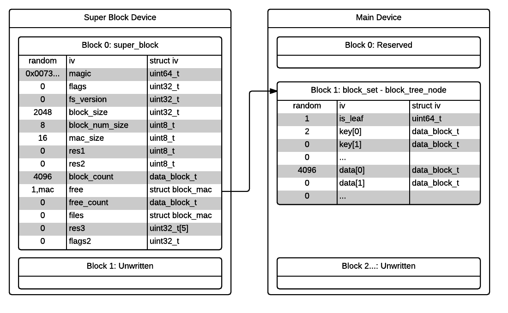
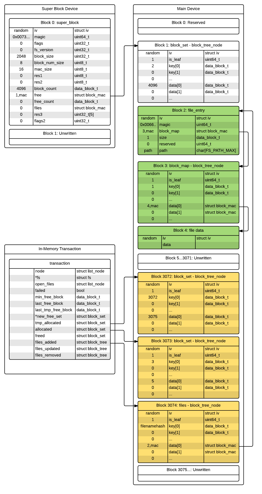
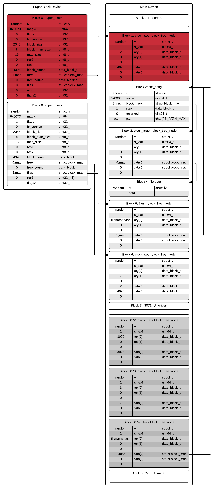

# Secure storage service

The secure storage service provides encrypted and tamper proof storage to
secure apps. All operations that modify the file system state are transactional.
Files can be opened, create or deleted by name (where the name is local to the
app). Open files support read, write, get-size and set-size operations. There is
currently no support for sparse files, permissions, quotas or directory
operations.

The server provides three client ports that provide various minimum
capabilities.

- The STORAGE_CLIENT_TD_PORT port offers tamper and rollback detection once the
non-secure OS has booted. This port should be used by most apps as it can offer
more storage and better performance than the other choices.

- The STORAGE_CLIENT_TDEA_PORT port also offers tamper and rollback detection
but can be available before the non-secure OS has booted if the boot loader
supports it.

- The STORAGE_CLIENT_TP_PORT port offers tamper proof storage. An app can for
instance use this port to store data needed by the boot loader that the
non-secure OS cannot erase. Note that non-secure code can prevent read and
write operations from succeeding, but it cannot modify on-disk data.

In the current code STORAGE_CLIENT_TDEA_PORT and STORAGE_CLIENT_TP_PORT map to
the same file system. Apps should not create files with the same name using
different ports, as it is device specific which ports share file systems.

## Code Organization

### Misc
- crypt - Encrypt/decrypt, mac and hash functions.
- rpmb - MMC rpmb protocol.

### File System Components
- block_device - Low level block IO.
- block_mac - Helper functions to bundle block numbers and mac values.
- block_cache - High level block IO.
- super - Super block load/store and file system initialization.
- block_tree - B+ tree implementation.
- block_set - Set operations built on top of B+ tree.
- block_allocator - Keeps track of free vs allocated blocks.
- transaction - Transaction init and complete code.
- block_map - Maps a logical block number to a physical block number and a mac.
- file - File management.

### IPC Specific Components
- ipc - IPC library
- proxy - Creates port that the non-secure OS connects to to provide.
- tipc_ns - Helper functions to send requests to non-secure proxy server.
- block_device_tipc - Implements block operations needed by the file system.
- client_tipc - Implement the secure storage tipc api on top of the file system.

## Disk layout

The file system stores two super-blocks on a device that has tamper detection.
The rest of the data can be stored in a non-secure partition or file. The
default implementation has two file systems. One file system stores the
super-blocks at the start of the mmc rpmb partition and all other blocks in a
file in the file system of the non-secure OS. The other file system stores all
data in the rpmb partition.

Both file systems use the same basic storage format but are configured to use
different block, block number and mac sizes. Two super blocks are used to allow
devices that don't provide atomic block write operations. Two version bits are
used to identify the most recent super block version. The main purpose of the
super block is to locate and validate the root of the free and file B+ trees.

Every block in the file system starts with a 16 byte iv struct. Each time the
data in the block changes, this is assigned a new random value. The rest of the
block is encrypted using this value and a device specific key.

The free set B+ tree list every free block in the file system as a set of
ranges. The key value in the B+ tree is the start of a free range and the data
value is the first block number not in the free range. Overlapping or adjacent
ranges are not allowed, so the data value is also the start of an allocated
range or, for the last free range, the number of blocks in the file system.

The file tree stores all the files in the file system. The key value is a hash
of the file name and is the same size and the block number size for the file
system. The data value is a block-mac that points to a file-entry block.
The file-entry block stores the full file name, file size and the root of a
block map where the file data can be found.

The block map tree is similar to the file tree except the key is the file block
plus one (0 keys are not supported), and the data points to file data.

The super block always points to a valid file system. To make changes to the
file system, any block that needs to change is copied to a new location. These
changes are tracked by in-memory transaction objects. Before a transaction is
complete it uses three block sets (the same storage format as the free set
described above) to keep track of allocated and freed blocks. Blocks that will
not be needed after the transaction completes are stored in the tmp_allocated
set. Blocks that will be needed are stored in allocated, and blocks that should
be added to the free set are stored in freed. To allow concurrent transactions
to update independent files without conflict, files modified by a transaction
are stored in temporary trees until the transaction is complete.

Example file system states of a file system using a 2k block size, 64 bit block
numbers and 16 byte mac values:

- Empty file system example.
  

- Active Transaction state after creating a new file and writing one byte to it.
  Note that at this point all the added nodes may only be in the block cache.
  

- State after completing transaction. The second super block is now the most
  recent one. The first super block still points to a valid file system, but
  as soon as the next transaction starts, those blocks may be reused. Block 3072
  and above may not be on disk and their cache entries are invalid.
  
